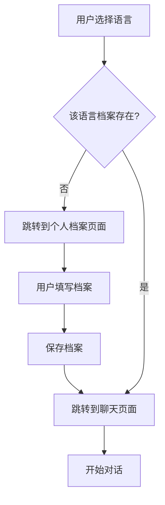

> Generated by TTADK Brainstorming Skill

## 个人档案功能设计文档

### 功能概述

为语言学习应用添加"个人档案"功能，允许用户为每门学习语言设置独立的档案信息，包括语言水平、学习动机、学习目标和每日学习时间。

### 设计决策

| 决策项 | 选择 |
|--------|------|
| 页面形式 | 独立页面 |
| 触发逻辑 | 每门语言首次进入聊天时自动跳转 |
| 数据存储 | 每语言独立档案 |
| 入口位置 | 用户下拉菜单 |

---

## 前端设计

### 路由设计

```
/:langCode/profile - 个人档案页面
```

### 页面组件

| 组件 | 文件路径 | 说明 |
|------|----------|------|
| ProfilePage | `src/pages/Profile/index.tsx` | 个人档案页面主组件 |
| ProfileForm | `src/pages/Profile/components/ProfileForm.tsx` | 表单组件 |
| LevelSelector | `src/pages/Profile/components/LevelSelector.tsx` | 语言水平选择器 |
| TagSelector | `src/pages/Profile/components/TagSelector.tsx` | 标签选择器（动机/目标） |

### 表单字段

| 字段 | 类型 | 必填 | 选项 |
|------|------|------|------|
| 语言水平 | 单选 | 是 | 初学者/中级/高级/精通 |
| 学习动机 | 多选 | 是 | 工作需要/旅游出行/考试认证/职业发展/影视娱乐/个人兴趣 |
| 学习目标 | 多选 | 是 | 口语表达/听力理解/阅读能力/写作能力/词汇语法 |
| 每日学习时间 | 单选 | 是 | 15分钟/30分钟/1小时/1小时+ |

### 导航入口修改

在 `src/components/Navbar.tsx` 的用户下拉菜单中添加"个人档案"选项：

```
用户下拉菜单:
├── 个人档案 (新增)
├── 聊天记录
└── 退出登录
```

### 首次访问逻辑

在 `src/pages/Chat/index.tsx` 中添加检查逻辑：

1. 用户进入 `/:langCode/chat`
2. 检查该语言的档案是否存在
3. 若不存在，重定向到 `/:langCode/profile`
4. 用户填写完成后，跳转回聊天页面

---

## 后端设计

### 数据库设计

新建 `language_profiles` 表：

```sql
CREATE TABLE language_profiles (
  id SERIAL PRIMARY KEY,
  user_id INTEGER NOT NULL REFERENCES users(id) ON DELETE CASCADE,
  language VARCHAR(10) NOT NULL,
  level VARCHAR(20) NOT NULL,
  motivations TEXT[],
  goals TEXT[],
  daily_time VARCHAR(20) NOT NULL,
  created_at TIMESTAMP DEFAULT CURRENT_TIMESTAMP,
  updated_at TIMESTAMP DEFAULT CURRENT_TIMESTAMP,
  UNIQUE(user_id, language)
);
```

### API 接口

| 方法 | 路径 | 说明 |
|------|------|------|
| GET | `/api/profile/:language` | 获取指定语言的档案 |
| POST | `/api/profile/:language` | 创建或更新档案 |
| DELETE | `/api/profile/:language` | 删除档案 |

### 请求/响应示例

**GET /api/profile/us**

```json
{
  "message": "success",
  "data": {
    "id": 1,
    "userId": 123,
    "language": "us",
    "level": "intermediate",
    "motivations": ["work", "career"],
    "goals": ["speaking", "listening"],
    "dailyTime": "30min",
    "createdAt": "2026-04-21T10:00:00Z",
    "updatedAt": "2026-04-21T10:00:00Z"
  }
}
```

**POST /api/profile/us**

```json
{
  "level": "intermediate",
  "motivations": ["work", "career"],
  "goals": ["speaking", "listening"],
  "dailyTime": "30min"
}
```

### 后端文件结构

```
src/
├── profile/
│   ├── profile.module.ts
│   ├── profile.controller.ts
│   ├── profile.service.ts
│   ├── profile.entity.ts
│   └── dto/
│       ├── create-profile.dto.ts
│       └── update-profile.dto.ts
```

---

## 交互流程



---

## 预计改动文件

### 前端

| 文件 | 操作 | 说明 |
|------|------|------|
| `src/pages/Profile/index.tsx` | 新建 | 个人档案页面 |
| `src/pages/Profile/components/ProfileForm.tsx` | 新建 | 表单组件 |
| `src/pages/Profile/components/LevelSelector.tsx` | 新建 | 水平选择器 |
| `src/pages/Profile/components/TagSelector.tsx` | 新建 | 标签选择器 |
| `src/pages/Profile/styles.css` | 新建 | 页面样式 |
| `src/api/profile.ts` | 新建 | API 调用 |
| `src/routes/index.tsx` | 修改 | 添加路由 |
| `src/components/Navbar.tsx` | 修改 | 添加入口 |
| `src/pages/Chat/index.tsx` | 修改 | 添加首次访问检查 |

### 后端

| 文件 | 操作 | 说明 |
|------|------|------|
| `src/profile/profile.module.ts` | 新建 | 模块定义 |
| `src/profile/profile.controller.ts` | 新建 | 控制器 |
| `src/profile/profile.service.ts` | 新建 | 服务层 |
| `src/profile/profile.entity.ts` | 新建 | 实体定义 |
| `src/profile/dto/*.ts` | 新建 | DTO 定义 |
| `src/app.module.ts` | 修改 | 注册模块 |

---

## 风险点

1. **数据迁移**：新表需要确保与现有用户数据兼容
2. **首访判断**：需要可靠的机制判断用户是否首次访问某语言
3. **移动端适配**：独立页面需要考虑移动端布局
